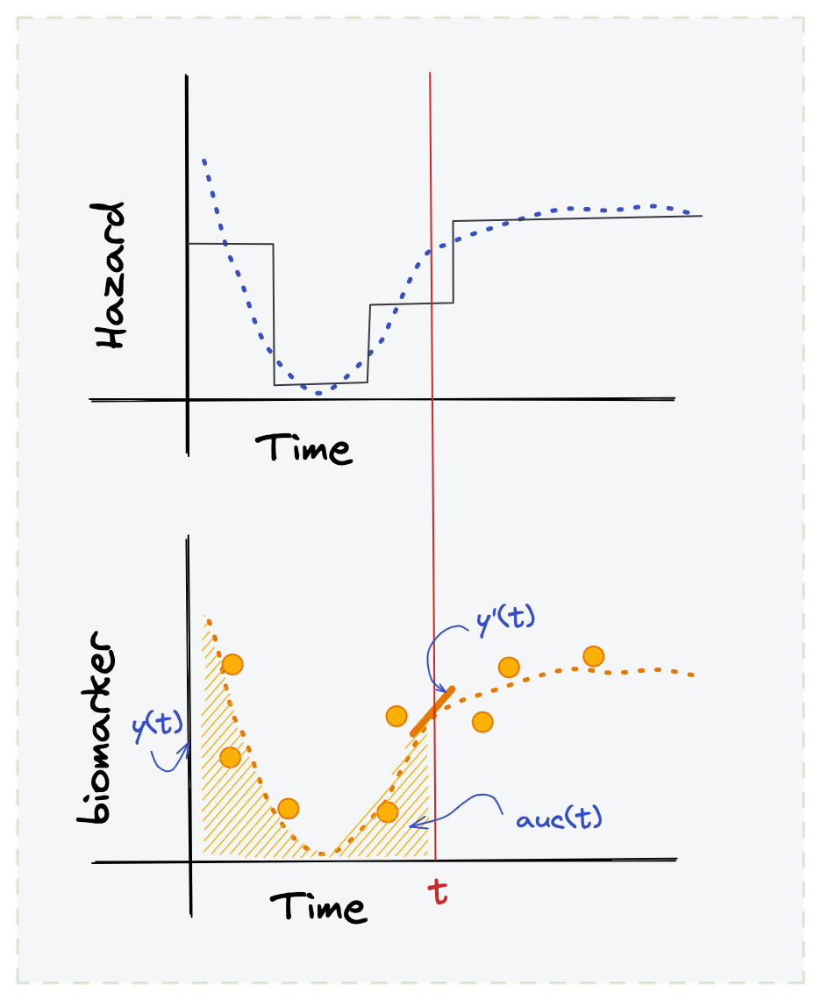

<style type="text/css">
.remark-slide-content {
    font-size: 15px;
}

.center2 {
  margin: 0;
  position: absolute;
  top: 50%;
  left: 50%;
  -ms-transform: translate(-50%, -50%);
  transform: translate(-50%, -50%);
}
</style>

```{r setup, include=F}
source("./global.R")
```


## Overview

.pull-left[
### 1- Motivation
 - [Data Generation Mechanism](#3)
 - [Observed Data](#4)
 - [Real Data Example](#5)
 - [Joint Modeling](#6)

### 2- Specifying the Model
 - [Longitudinal + TTE](#7)
 - [Jointly](#9)
 - [Intuition](#10)
 - [Generalization](#11)
]

.pull-right[
### 3- Solving the Model
 - [Approach](#12)
 - [Software](#13)
 - [In Paractice](#14)
 
### 4- Application
- [PBC data](#15)
- [Coding the Model](#16)

]


---
## Motivation: Data Generation Mechanism

Multiple correlated repeated measures ~  Events that discontinue observation


---
## Motivation: Observed Data

What happens if the shape of the biomarker is associated with the event?


<!--  -->


---

## Motivation: Real Data Example

[Primary biliary cholangitis (PBC)](https://en.wikipedia.org/wiki/Primary_biliary_cholangitis)
is an autoimmune disease affecting liver. As 
the disease advances, abnormally high levels of serum bilirubin can be observed.

312 patients randomized 1:1 to placebo:treatment (D-penicillamine) and observed:


```{r pbc, message=FALSE,echo=FALSE, fig.retina = 3, fig.width=10, fig.height=6}

srv_d <- pbc2 %>% distinct(id, age, sex, drug, years, status) %>% 
  mutate(death = if_else(status == "dead", 1, 0))
srv_ft <- survfit(Surv(time = years, event = death) ~ drug + sex, data = srv_d)

p1 <- ggsurvplot(fit = srv_ft, data = srv_d,palette = "jco",legend = "bottom")+
  guides(colour = guide_legend(nrow = 5))

p2 <- pbc2 %>% 
  ggplot(aes(x = year, y = log(serBilir),colour = drug)) +
  facet_wrap(~sex, nrow = 2)+
  geom_smooth()+
  geom_line(aes(group = id), alpha = .2) +
  xlab("Time (years)") +
  ylab("log (serum bilirubin)") +
  ggsci::scale_color_jama() +
  custom_theme()

p1$plot + p2 #+  plot_layout(widths = c(2, 1))
```


---
## Motivation: Joint Modeling

<br> <br> <br> <br>

.pull-left[

- Relation of interest: serum bilirubin ~ death

- But death &#8594; missingness of serum bilirubin 

- This is a Missng Not at Random (MNAR) case

- Ignoring MNAR &#8594; wrong (biasd) estimate of _bili(t)_

- Also _bili(t)_ is endogenous wrspt TTE &#8594; inappropriate as time-dependent
covariate in a survival coxph model

- `r icons::fontawesome("hand-point-right")` need to solve **joint likelihood of
_bili(t)_ and death**
]


.pull-right[
```{r dag, message=FALSE,echo=FALSE, fig.retina = 3, fig.height=3}
nodes <- data.frame(id = c(1,3,2), 
                    label = c("bilirubin","treatment","death"),
                    shadow = c(T,T,T),
                    shape='circle') %>%
  mutate(font.size = 100/nchar(label),
         color = "darkgray")

edges <- data.frame(from = c(1, 3, 3, 2), 
                    to = c(2, 1, 2, 1),
                    arrows = c("to", "to", "to", "to"),
                    dashes = c( F, F, F, T)) %>%
  mutate(color = if_else(dashes == T, "red","darkgray" ))

visNetwork(nodes = nodes,edges = edges,  width = "100%")
```
]

---
## Specifying the models*: longitudinal + TTE


.pull-left[
### 1. Biomarker(t) model:

$$y_i(t) = x_i(t) \beta + z_i(t) b_i + \epsilon_i(t) \; (1)$$
$$\eta_i(t) := E[y_i] = x_i(t) \beta + z_i(t) b_i$$

<br> <br> <br> 

- $y_i(t)$ is the observed value of biomarker at time $t$
- $\eta_i(t)$ is the unobserved true value of biomarker at time $t$
- $\beta$ is the vector of fix-effect parameters
- $b_i$ is the vector of random-effect parameters for subject $i$ ~ $N(0, D)$
- $\epsilon_i$ is the iid Gaussian noise ~ $N(0,\sigma)$
]

--
.pull-right[
### 2. Hazard(t) model:

$$h_i(t | M_i(t), w_i)=$$
$$lim_{\Delta \to 0} P\lbrace t \leq T < t + \Delta t | T \geq t, M_i(t), w_i\rbrace/ \Delta t =$$
$$h_0(t)exp\lbrace w_i \gamma + f(\alpha, w_i, b_i, M_i(t))\rbrace \; (2)$$
<br>
commonly used functions $f$ are
$$f:= \alpha \eta_i(t) \; (3)$$
$$f:= \alpha_1 \eta_i(t) + \alpha_2 \eta_i^{'}(t)\; (4)$$ where
$$\eta_i^{'}(t) = \frac{d\eta_i(t)}{dt}\; (5)$$
]

.footnote[*this deviates from [An overview of joint modeling of time-to-event and longitudinal outcomes](https://www.annualreviews.org/doi/abs/10.1146/annurev-statistics-030718-105048)
see [page8](#9)]


---
## Specifying the Model*: Jointly

### 3. Joint likelihood for the observed $y_i, T_i*, \delta_i$:

$$l(\alpha, \beta, \gamma, \sigma) = \sum_{i=1}^n log (f(y_i, T_i^*, \delta_i))=$$

$$\sum_{i=1}^n log(\int f_Y(y_i | b_i)f_T(T_i^*|b_i)f_b(b_i)db_i) =$$
$$\sum_{i=1}^n log(\int f_Y(y_i | b_i)h(T_i*|b_i)^{\delta_i}S(T_i^*|b_i)f_b(b_i)db_i)\; (6)$$
where
- $f_Y$ is the density function for $y_i$
- $f_b$ is the density function for random effect $b_i$
- $h(t)$ is the hazard function
- $S(t)$ is the survival function
- $\delta_i$ event indicator
- $b_i$ random effect within subject
- see [page6](#7) for $\alpha$, $\beta$, $\gamma$ and $\sigma$


.footnote[*this deviates from [An overview of joint modeling of time-to-event and longitudinal outcomes](https://www.annualreviews.org/doi/abs/10.1146/annurev-statistics-030718-105048) see [page8](#9)]


---
## Specifying the Model: Intuition

.pull-left[

<br> <br> <br> <br>

- The model assumes $h_0(t)$ is linked with $y(t)$ through $f$

- when $f$ is defined by equation $(3)$, $h_0(t)$ and the unobserved true value
of biomarker at time $t$ are linked by scale factor $\alpha$

- when $f$ is defined by equation $(4)$, in addition to association with the 
value of biomarker at time $t$ through $\alpha_1$, $h_0(t)$ is associate with 
temporal slope of the biomarker $\alpha_2$

- Other features such as area under the curve of the biomarker could inform the
association between hazard and biomarker trajectories

]

.pull-right[

]


---

## Specifying the Model: Generalization

The specification shared in previous slides, is a simplification of a more 
generalized formulation given in [*An overview of joint modeling of time-to-event and longitudinal outcomes*](https://www.annualreviews.org/doi/abs/10.1146/annurev-statistics-030718-105048) by Papageorgiou et al. 

These generalizations:

- $K$ biomarkers being observed ( $K=1$ in the simplified formulation)
- Each biomarker is allowed to have its own observation intervals
- Different types of censoring
$$\delta = \begin{cases} 0 &:& \; cens_{right} \\ 1 &:& event \\ 2 &:& cens_{left} \\3 &:& cens_{interval} \end{cases}$$
- Extends eq (3) to generalized link (i.e. glmm)
- *Exogenous* time-dependent covariate in survival model
- Multiple TTE in competing risks setting (not included by Papageorgiou et al.)
- `r icons::fontawesome("hand-point-right")` most generalized formulation turns 
out to be overly cumbersome and is (IMO) less useful in practice. Therefore, for intro
here I opted for simplified (special case) model
- Notation/flow more closely follows lecture notes by Ben French for UW SISCER 2019

---
## Solving the Model: Approach

#### Baseline Hazard, $h_0(t)$:
- Needed when working with the full likelihood (unlike coxph models)
- Parametric option include:
 - $h_0(t) = \lambda$
 - $h_0(t) = \lambda a t^{a-1}$
- Flexible options include:
 - Piecewise constant
 - Regression splines; e.g. B-splines
 
#### Solvers:
- Frequentist maximization of likelihood
 - EM
 - Newton-Raphson
- Bayesian
 - Integration via Laplace approximation
 - Adaptive Gaussian quadrature


---
## Solving the Model: Software

- *[`JM` by Rizopoulos et al.](https://cran.r-project.org/web/packages/JM/JM.pdf):*
 - Frequentist approach (EM)
 - Supports a variety of parametric and flexible construction of $h_0(t)$
 - Supports single continuous longitudinal outcome
 - Does not support multiple competing risk settings
 - Supports options outlined in eq (3) and eq. (4)
 - Supports dynamic prediction

- *[`JMbayes` by Rizopoulos et al.](https://cran.r-project.org/web/packages/JMbayes/index.html):*
 - Bayesian approach (MCMC)
 - Supports a variety of parametric and flexible construction of $h_0(t)$
 - Supports multivariate continuous and categorical longitudinal outcomes
 - Supports multiple competing risk settings
 - Supports dynamic prediction

- Other R packages and functionalities*:
 - **Solver:** 
 [`joinR`](https://cran.r-project.org/web/packages/joineR/joineR.pdf), 
 [`joineRML`](https://cran.r-project.org/web/packages/joineRML/index.html), 
 [`frailtypack`](https://cran.r-project.org/web/packages/frailtypack/index.html),
 [`rstanarm`](https://cran.r-project.org/web/packages/rstanarm/vignettes/jm.html), 
 ...
 
 - **Simulation:** variety of packages provide simulation capabilities including
 [`JM`](https://cran.r-project.org/web/packages/JM/JM.pdf),
 [`simSurv`](https://cran.r-project.org/web/packages/simsurv/vignettes/simsurv_usage.html), 
 [`simjm`](https://github.com/sambrilleman/simjm),
 [`bamlss`](https://bayesr.r-forge.r-project.org/reference/simJM.html), ...

.footnote[ *I have not yet used them]

---
## Solving the Model: In Paractice

JM framework/SW are powerful but "getting things to work" could require some 
effort

### Model accuracy $\leftrightarrow$ complexity

- Like most inference framework care parameterization pays off
- In addition to overfitting, convergence to a solution is not guaranteed 

### Estimating $h_0(t)$: flexibility $\leftrightarrow$ solution stability

- splines or piecewise constant $h_0$ are more flexible but harder to solve

### Data formatting
- Moderate your expectation of consistent/standardized (e.g. `tidy`) approach to
 data
- You may need to spend some time formatting/cleaning data.
 - Ensure conformity to required data structure
 - Align time units across TTE and longitudinal process
 - If your TTE is not death for example, you will need to manually censor 
 longitudinal data


---
## PBC data: Combinding longitudinal and TTE

<!-- JM package provides "followup [observation of] of 312 randomized patients with  -->
<!-- primary biliary cirrhosis, a rare autoimmune liver disease, at Mayo Clinic" -->

```{r pbc_i, message=FALSE,echo=FALSE, fig.retina = 3, fig.width=10}
set.seed(9)
pbc2 %>% distinct(id) %>% 
  sample_n(size = 16,replace = F) %>%
  left_join(x = ., y = pbc2) %>% 
  ggplot(aes(x = year, y = log(serBilir))) +
  geom_point(alpha = .5)+
  geom_vline(aes(xintercept=years, linetype=factor(status!='dead')), lwd=.5) + 
  geom_smooth(se=FALSE, method='lm') +
  facet_wrap(~ id) +
  scale_x_continuous(name='Time (years)', limits=c(0,15)) +
  ylab("log (serum bilirubin)")+
  scale_linetype_manual(name = "status",breaks=c(FALSE, TRUE), values=c(1, 2),
                        labels=c('death', 'censored'))+
  custom_theme()+
  ggtitle("16 randomly selected cases")
```


---
## Application: Coding the Model

**1. Model longitudinal process:** Here, we interested in trt effect.
- Does the slope of bili differs between trt arms?

```{r modt_build, echo = T}
mod_t <- lme(log(serBilir) ~ year + drug:year,
             random = ~ 1 + year|id, data = pbc2)
```


**2. Model TTE:** Here, we interested in trt effect.
- Is there hazard shift associated with treatment?
- We use sex as precision variable
- `r icons::fontawesome("exclamation-triangle") %>% icons::icon_style(fill = "orange")` note requirement `x = T`

```{r modcox_build, echo=TRUE}
mod_cox <- coxph(Surv(time = years, event = death) ~ drug + sex, 
                 data = srv_d, x = T)
```

**3. Model JM:** Combine the two model specifications and jointly solve with defaults:
- **`parameterization = value`** i.e specification in [eq(3)](#8)
- **`method = "weibull-PH-aGH"`**  &#8594; parameterized weibull prop hazard

```{r modjm_build, echo=TRUE}
mod_jm <- jointModel(lmeObject = mod_t, survObject = mod_cox,
                     timeVar = "year")
```


---
