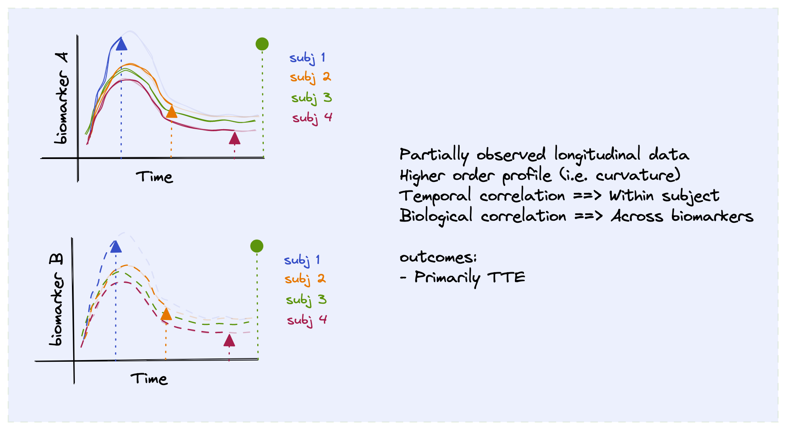

## Motivation: Data Generation Mechansim

Multiple correlated repeated measures ~  Events that discontinue observation

---
## Motivation: Observed Data

What happens if the shape of the biomarker is associated with the event?

<!--  -->

---

# Notation and definitions

Define high level notations

---

class: center, middle

# Thanks!

Slides created via the R package [**xaringan**](https://github.com/yihui/xaringan).

The chakra comes from [remark.js](https://remarkjs.com), [**knitr**](https://yihui.org/knitr/), and [R Markdown](https://rmarkdown.rstudio.com).
