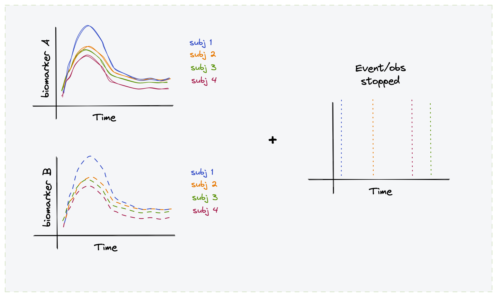

<style type="text/css">
.remark-slide-content {
    font-size: 15px;
}

.center2 {
  margin: 0;
  position: absolute;
  top: 50%;
  left: 50%;
  -ms-transform: translate(-50%, -50%);
  transform: translate(-50%, -50%);
}
</style>

```{r setup, include=F}
source("./global.R")
```


## Motivation: Data Generation Mechansim

Multiple correlated repeated measures ~  Events that discontinue observation


---
## Motivation: Observed Data

What happens if the shape of the biomarker is associated with the event?


<!--  -->


---

## Motivation: Real Example Data

[Primary biliary cholangitis (PBC)](https://en.wikipedia.org/wiki/Primary_biliary_cholangitis)
is an autoimmune disease affecting liver. As 
the disease advances, abnormally high levels of serum bilirubin can be observed.

312 patients randomized 1:1 to placebo:treatment (D-penicillamine) and observed:


```{r pbc, message=FALSE,echo=FALSE, fig.retina = 3, fig.width=10, fig.height=6}

srv_d <- pbc2 %>% distinct(id, age, sex, drug, years, status) %>% 
  mutate(death = if_else(status == "dead", 1, 0))
srv_ft <- survfit(Surv(time = years, event = death) ~ drug + sex, data = srv_d)

p1 <- ggsurvplot(fit = srv_ft, data = srv_d,palette = "jco",legend = "bottom")+
  guides(colour = guide_legend(nrow = 5))

p2 <- pbc2 %>% 
  ggplot(aes(x = year, y = log(serBilir),colour = drug)) +
  facet_wrap(~sex, nrow = 2)+
  geom_smooth()+
  geom_line(aes(group = id), alpha = .2) +
  xlab("Time (years)") +
  ylab("log (serum bilirubin)") +
  ggsci::scale_color_jama() +
  custom_theme()

p1$plot + p2 #+  plot_layout(widths = c(2, 1))
```


---
## Motivation: Need for joint modeling

<br> <br> <br> <br>

.pull-left[

- Relation of interest: serum bilirubin ~ death

- But death &#8594; missingness of serum bilirubin 

- This is a Missng Not at Random (MNAR) case

- Ignoring MNAR &#8594; wrong (biasd) estimate of _bili(t)_

- Also _bili(t)_ is endogenous wrspt TTE &#8594; inappropriate as time-dependent
covariate in a survival coxph model

- `r icons::fontawesome("hand-point-right")` need to solve **joint likelihood of
_bili(t)_ and death**
]


.pull-right[
```{r dag, message=FALSE,echo=FALSE, fig.retina = 3, fig.height=3}
nodes <- data.frame(id = c(1,3,2), 
                    label = c("bilirubin","treatment","death"),
                    shadow = c(T,T,T),
                    shape='circle') %>%
  mutate(font.size = 100/nchar(label),
         color = "darkgray")

edges <- data.frame(from = c(1, 3, 3, 2), 
                    to = c(2, 1, 2, 1),
                    arrows = c("to", "to", "to", "to"),
                    dashes = c( F, F, F, T)) %>%
  mutate(color = if_else(dashes == T, "red","darkgray" ))

visNetwork(nodes = nodes,edges = edges,  width = "100%")
```
]

---
## Specifying the model

### 1. longitudinal process

$$y_i(t) = x_i(t) \beta + z_i(t) b_i + \epsilon_i(t)$$
--

$$\eta_i(t) := E[y_i] = x_i(t) \beta + z_i(t) b_i$$


---
## PBC data: Combinding longitudinal and TTE

<!-- JM package provides "followup [observation of] of 312 randomized patients with  -->
<!-- primary biliary cirrhosis, a rare autoimmune liver disease, at Mayo Clinic" -->

```{r pbc_i, message=FALSE,echo=FALSE, fig.retina = 3, fig.width=10}
set.seed(9)
pbc2 %>% distinct(id) %>% 
  sample_n(size = 16,replace = F) %>%
  left_join(x = ., y = pbc2) %>% 
  ggplot(aes(x = year, y = log(serBilir))) +
  geom_point(alpha = .5)+
  geom_vline(aes(xintercept=years, linetype=factor(status!='dead')), lwd=.5) + 
  geom_smooth(se=FALSE, method='lm') +
  facet_wrap(~ id) +
  scale_x_continuous(name='Time (years)', limits=c(0,15)) +
  ylab("log (serum bilirubin)")+
  scale_linetype_manual(name = "status",breaks=c(FALSE, TRUE), values=c(1, 2),
                        labels=c('death', 'censored'))+
  custom_theme()+
  ggtitle("16 randomly selected cases")
```


---
# Notation and definitions

Define high level notations

---

class: center, middle

# Thanks!

Slides created via the R package [**xaringan**](https://github.com/yihui/xaringan).

The chakra comes from [remark.js](https://remarkjs.com), [**knitr**](https://yihui.org/knitr/), and [R Markdown](https://rmarkdown.rstudio.com).
